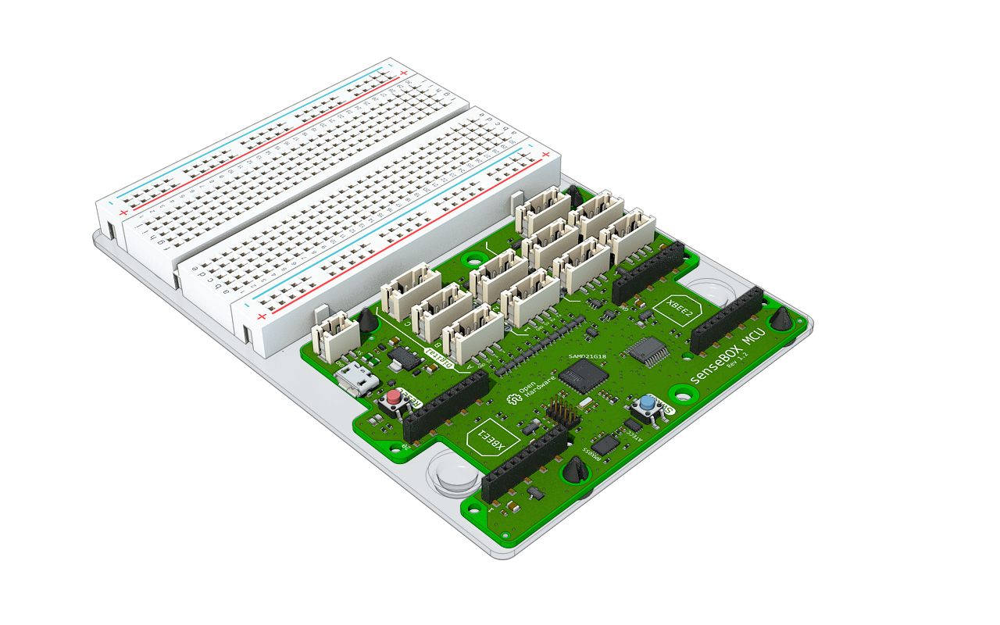
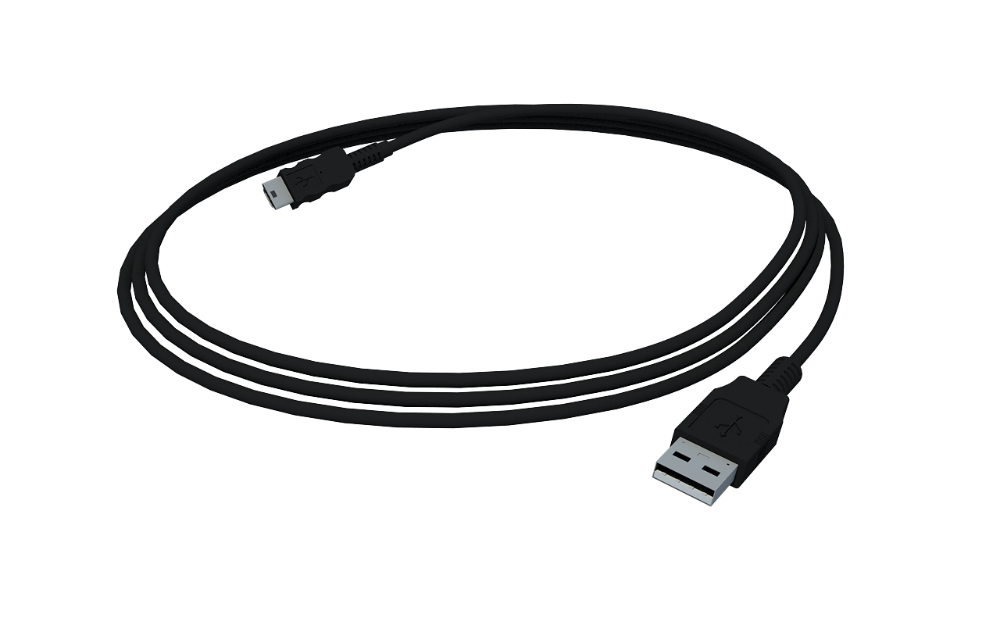
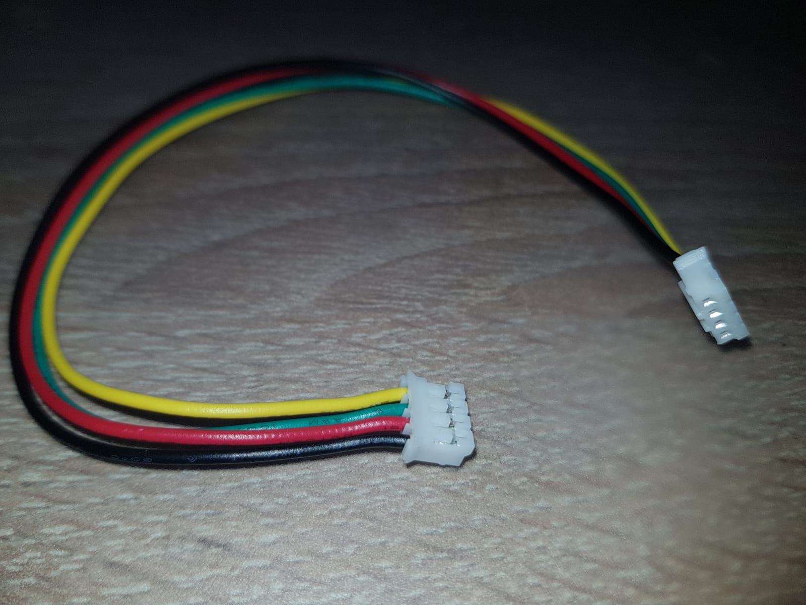
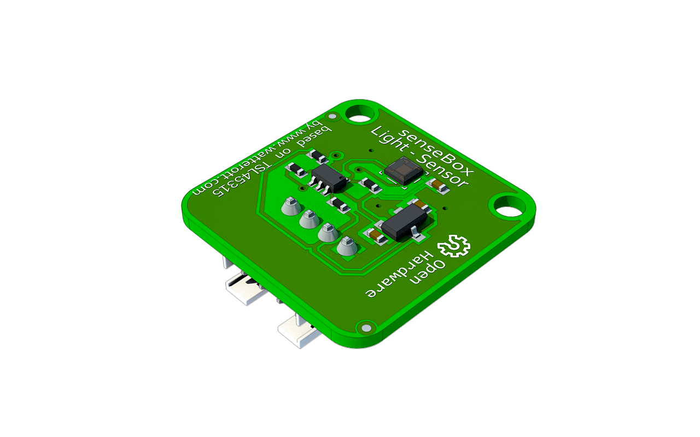
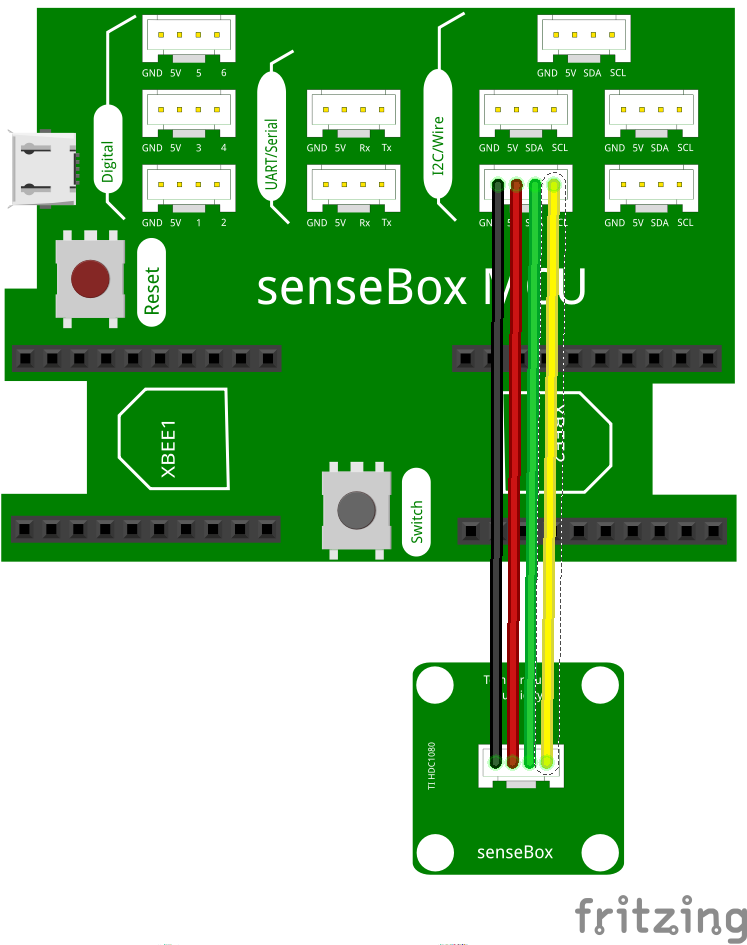
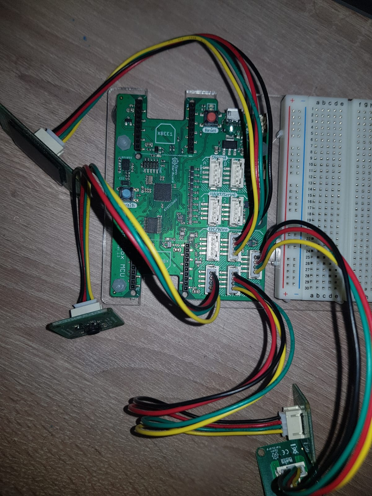
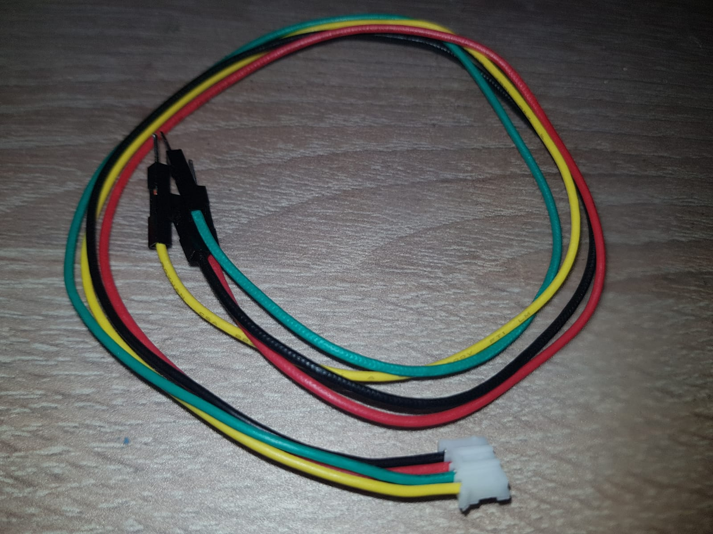
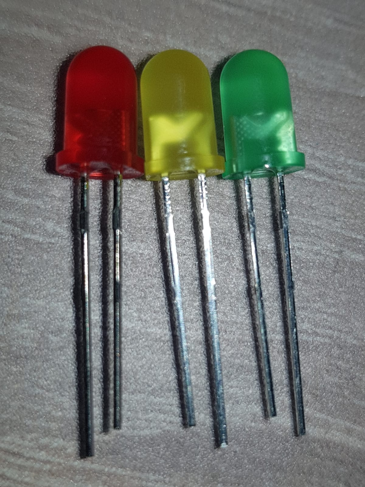
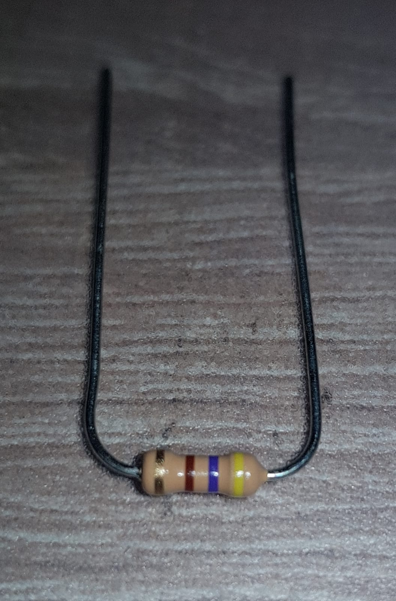
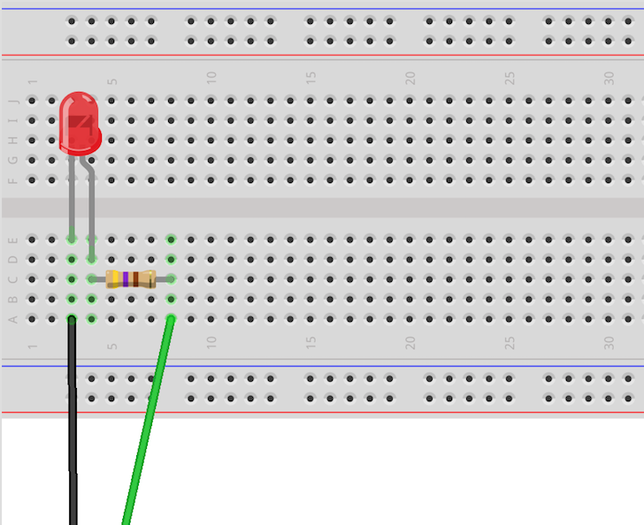

# SenseBox Testscript
Ein Testprogramm für alle Funktionen des SenseBox Edu Kits

## Ziel
Nach einem Programmierkurs mit der SenseBox müssen alle Bauteile nach Vollständigkeit und Funktionalität überprüft werden.
Mit dem einfachen SenseBox Testprogramm werden aktuell folgende Bauteile und Funktionen getestet ohne, dass Sie ein eigenes komplexes Skript schreiben müssen:
- BMP280: Temperatur, Luftdruck
- HDC1080: Temperatur, Luftfeuchtigkeit
- VEML+TSL: Helligkeit, UV-Einstrahlung
- OLED-Display: Text, Rechtecke und Kreise
- Beschleunigungssensor
- LEDs: onBoard, externe
- Button: onBoard

## Ablauf
Um die SenseBox zu testen muss die SenseBox erst aufgebaut, das Script installiert und dann die Tests der Funktionen geprüft werden.

- Aufbau
- Installation
- Testen

## Aufbau

### SenseBox
Sie benötigen die SenseBox, ein Mini-USB Kabel und ein Computer.

|                     SenseBox-Board                      |              Mini USB-Kabel               |
| :-----------------------------------------------------: | :---------------------------------------: |
|  |  |

### Sensoren und Display
Zum Anschluss der Sensoren verwenden wir ausschließlich die Kabel mit doppeltem Stecker.
Wir brauchen folgende Teile:
|             Stecker              |             HDC1080              |             BMP280             |              VEML+TSL              |                OLED-Display                |
| :------------------------------: | :------------------------------: | :----------------------------: | :--------------------------------: | :----------------------------------------: |
|  |  |  |  |  |

Alle Sensoren müssen an ein I2C Port angeschlossen werden. Es gibt 5 solcher Ports, die Reihenfolge und welcher verwendet wird spielt keine Rolle.

|                Schema für ein Sensoren                |       Alle Sensoren angeschlossen       |
| :---------------------------------------------------: | :-------------------------------------: |
|  |  |

### LEDs
Zur Einfachheit schließen wir lediglich eine einzelne LED an, testen aber alle LEDs **nacheinander** durch austauschen.

**Bauteile:**
|         Stecker zu Pins         |                         LEDs                         |         Widerstand (Gelb-Lila-Braun-Gold)         |
| :-----------------------------: | :--------------------------------------------------: | :-----------------------------------------------: |
|  |  |  |
Wichtig! Beim Widerstand muss der Farbcode stimmen! Er ist Gelb-Lila-Braun-Gold

**Anschluss**
|                            Schema                             |                            Realität                            |
| :-----------------------------------------------------------: | :------------------------------------------------------------: |
|  |  |
Das lange Beinchen der LED ist hier mit einem kleinen Knick illustriert.
1. Stecker in SenseBox an **Port Digital A** (in Schriftrichtung ganz oben links) einstecken
2. Schwarzes Kabel an A3 auf Steckbrett einstecken
3. Eine LED mit dem kurzen Beinchen an E3 und mit dem langen Beinchen an E4 einstecken. (Am einfachsten gehts mit dem langen zuerst einstechen und dann mit dem kurzen nachziehen)
4. Körper des Widerstands mit zwei Fingern der selben Hand greifen und mit der anderen Hand runter biegen. Gleiches für die andere Seite, damit der Widerstand wie auf dem Bild oben aussieht.
5. Widerstand in C4 und C8 stecken.
6. Grünes Kabel in A8 stecken
7. Überprüfen ob alles richtig eingesteckt ist. Alle Bauteile sollten gerade stehen können

Das gelbe und rote Kabel ist ungenutzt und kann ignoriert werden.

Später werden wir die LED im Betrieb einfach rausnehmen und durch eine andere ersetzen, um alle zu testen.

### Vollständiger Aufbau

## Installation
Nachdem die SenseBox vollständig aufgebaut und mit dem PC verbunden wurde muss das Testprogramm übertragen werden.

Dafür muss die SenseBox in den Programmiermodus, indem wir den **roten "Reset" Button schnell zwei mal hintereinander drücken**.  
Die SenseBox sollte sich nun **trennen und** nach kurzer Zeit **erneut** **mit** dem **PC verbinden**.  
Der PC sollte nun Speicherzugriff auf die SenseBox vergleichbar mit einem USB-Stick haben. (Eventuell hat sich das entsprechende Fenster geöffnet).  
Nun kopieren wir die "**testscript.bin**" Datei auf die SenseBox.  
Kurz danach sollte sich die SenseBox **automatisch trennen und neustarten**.

Die **Installation** ist damit **abgeschlossen**!

## Tests

Die Tests selbst testen jeweils nur auf erfolgreiche Initialisierung aller Komponenten.  
In diesem Fall leuchten **beide Status LEDs** neben dem Reset Button **grün**!

Zur wirklichen Funktionalität müssen Sie aktiv werden und eine manuelle Überprüfung auf Plausibilität durchführen.  
Überprüfen Sie, ob die Messwerte der Sensoren sinnvoll sind und LEDs tatsächlich leuchten und ihren Zweck erfüllen.

### Display

Das Display sollte nach einem kurzen Ladebildschirm ein netten Smiley mit der Aufschrift "TestScript" anzeigen. 

### Button

Nach dem Drücken des blauen onBoard Buttons sollte auf dem Display eine andere Seite angezeigt werden.

### Sensoren

Jeder Sensor hat eine eigene Seite auf dem Display die sie mit erneuter Betätigung des blauen onBoard Buttons durchklicken können.  
Zur Orientierung sind einige Schätzwerte zum Vergleich gegeben. Diese sollten natürlich von Ihrer Umgebung abhängig sein!

#### **HDC1080: Temperatur & Luftfeuchtigkeit**

- Temperatur: ~20°C
- Luftfeuchtigkeit: 30-50%

#### **BMP280: Temperatur & Luftdruck**

- Temperatur: ~20°C
- Luftdruck: --

#### **VEML-TSL: Helligkeit & UV-Einstrahlung**

- Helligkeit
    - entfernt eines Fensters: 10-100
    - in Nähe eines Fensters: 100-1000
- UV-Einstrahlung
    - entfernt eines Fensters: --
    - in Nähe eines Fensters

#### **Accelerometer: Beschleunigung** 

- Beschleunigung X
    - in Ruhe: ~0
    - beim Schütteln: 0-10
- Beschleunigung Insgesamt
    - in Ruhe: ~9,81 (Schwerkraft g)
    - beim Schütteln: --

#### Alle Seiten

(Tabelle mit Bildern aller Seiten)

### LEDs

Die onBoard LEDs sollten bereits grün leuchten.

Die aufgebaute LED sollte kontinuierlich leuchten. Nachdem die LED leuchtet ist sie funktionsfähig und kann entsprechend nach  mit der nächsten ausgetauscht werden, um weitere zu testen.  
Falls Sie unsicher sind, ob sie die LED richtig angeschlossen haben, drehen Sie sie um. Sie sollte in nur einer Richtung leuchten!