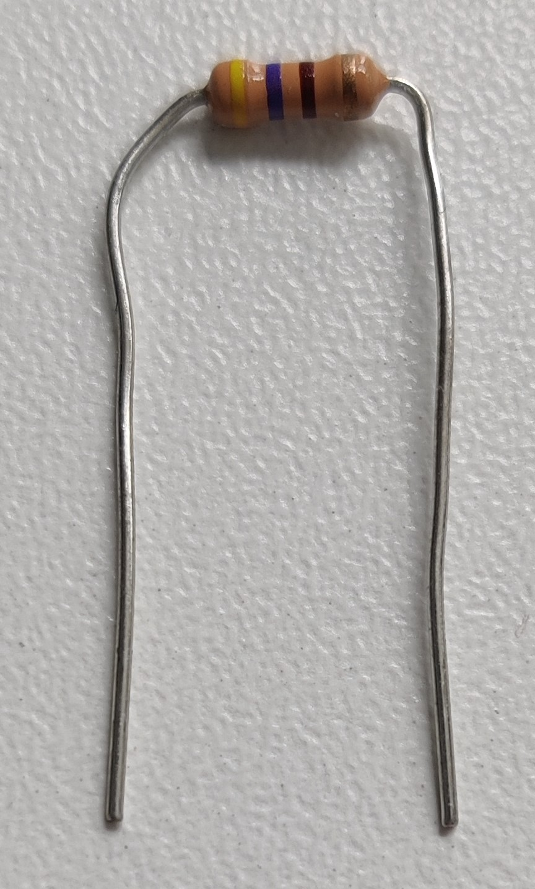

# SenseBox Testscript
Ein Testprogramm für alle Funktionen des SenseBox Edu Kits

## Download
|                                           SenseBox Programm                                           |                                             Blockly Code                                              |                                               .ino Code                                               |
|:-----------------------------------------------------------------------------------------------------:|:-----------------------------------------------------------------------------------------------------:|:-----------------------------------------------------------------------------------------------------:|
| [Download testscript.bin](https://github.com/GeneralMine/SenseBox-TestScript/raw/main/testscript.bin) | [Download testscript.xml](https://github.com/GeneralMine/SenseBox-TestScript/raw/main/testscript.xml) | [Download testscript.ino](https://github.com/GeneralMine/SenseBox-TestScript/raw/main/testscript.ino) |
|                                   Zum direkt auf die SenseBox laden                                   |                                      Selbst weiter programmieren                                      |                                   Weiterprogrammieren für Experten                                    |

## Ziel
Nach der Arbeit mit der SenseBox - z.B. im Rahmen eines Programmierkurses - müssen alle Bauteile auf Vollständigkeit und Funktionalität überprüft werden.
Es werden folgende Bauteile getestet:
- BMP280: Temperatur, Luftdruck
- HDC1080: Temperatur, Luftfeuchtigkeit
- VEML+TSL: Helligkeit, UV-Einstrahlung
- OLED-Display: Text, Rechtecke und Kreise
- Beschleunigungssensor
- LEDs: onBoard, externe
- Button: onBoard

## Inhalt
- [SenseBox Testscript](#sensebox-testscript)
  - [Download](#download)
  - [Ziel](#ziel)
  - [Inhalt](#inhalt)
  - [Aufbau](#aufbau)
    - [SenseBox](#sensebox)
    - [Sensoren & Display](#sensoren--display)
    - [LED](#led)
    - [Vollständiger Aufbau](#vollständiger-aufbau)
  - [Installation](#installation)
  - [Tests](#tests)
    - [Display](#display)
    - [Button](#button)
    - [Sensoren](#sensoren)
      - [HDC1080: Temperatur & Luftfeuchtigkeit](#hdc1080-temperatur--luftfeuchtigkeit)
      - [BMP280: Temperatur & Luftdruck](#bmp280-temperatur--luftdruck)
      - [VEML-TSL: Helligkeit & UV-Einstrahlung](#veml-tsl-helligkeit--uv-einstrahlung)
      - [Accelerometer: Beschleunigung](#accelerometer-beschleunigung)
      - [Alle Sensorseiten](#alle-sensorseiten)
    - [LEDs](#leds)
  - [Geplante weitere Tests](#geplante-weitere-tests)
  - [Mitwirken](#mitwirken)
  - [Mitwirkende](#mitwirkende)

## Aufbau
### SenseBox
Sie benötigen die SenseBox, ein Mini-USB Kabel und ein Computer.

|                    SenseBox-Board                     |                   Mini USB-Kabel                   |
|:-----------------------------------------------------:|:--------------------------------------------------:|
|  |  |

### Sensoren & Display
Zum Anschluss der Sensoren verwenden wir ausschließlich die Kabel mit doppeltem Stecker.
Wir brauchen folgende Teile:
|                     Stecker                     |                            HDC1080                            |                            BMP280                            |                    VEML+TSL                     |                    OLED-Display                     |
|:-----------------------------------------------:|:-------------------------------------------------------------:|:------------------------------------------------------------:|:-----------------------------------------------:|:---------------------------------------------------:|
|  |  |  |  |  |

Alle Sensoren müssen an ein I2C Port angeschlossen werden. Es gibt 5 solcher Ports, die Reihenfolge und welcher verwendet wird spielt keine Rolle.

|                 Alle Sensoren angeschlossen von oben                  |                  Alle Sensoren angeschlossen von der Seite                  |
|:---------------------------------------------------------------------:|:---------------------------------------------------------------------------:|
|  |  |

### LED
Zur Einfachheit schließen wir lediglich eine einzelne LED an, testen aber alle LEDs **nacheinander** durch austauschen.

**Bauteile:**
|                Stecker zu Pins                |                             LEDs                              |                         Widerstand                         |
|:---------------------------------------------:|:-------------------------------------------------------------:|:----------------------------------------------------------:|
|                                               |                       beliebige Farben                        |                   (Gelb-Lila-Braun-Gold)                   |
|  |  |  |

**Anschluss**
|                            Anschluss am Breadboard                             |                      Anschluss an SenseBox                      |
|:------------------------------------------------------------------------------:|:---------------------------------------------------------------:|
|  |  |
|    Kurzes Beinchen der LED in E3 und langes in D4, Widerstand in C4 und C8     | Stecker in Digital A, Schwarzes Kabel an A3, Grünes Kabel an A8 |

1. Stecker in SenseBox an **Port Digital A** (in Schriftrichtung ganz oben links) einstecken
2. Schwarzes Kabel an A3 auf Steckbrett einstecken
3. Eine LED mit dem kurzen Beinchen an E3 und mit dem langen Beinchen an D4 einstecken. (Am einfachsten gehts mit dem langen zuerst einstechen und dann mit dem kurzen nachziehen)
4. Körper des Widerstands mit zwei Fingern der selben Hand greifen und mit der anderen Hand runter biegen. Gleiches für die andere Seite, damit der Widerstand wie auf dem Bild oben aussieht.
5. Widerstand in C4 und C8 stecken.
6. Grünes Kabel in A8 stecken
7. Überprüfen ob alles richtig eingesteckt ist. Alle Bauteile sollten gerade stehen können

Das gelbe und rote Kabel ist ungenutzt und kann ignoriert werden.

Später werden wir die LED im Betrieb einfach rausnehmen und durch eine andere ersetzen, um alle zu testen.

### Vollständiger Aufbau
So sollte es am Ende aussehen:
|                          Vollständiger Aufbau                          |
|:----------------------------------------------------------------------:|
| [Vollständiger Aufbau](./Bilder/Aufbau/sensebox_sensoren_led_oben.jpg) |

## Installation
Nachdem die SenseBox vollständig aufgebaut und mit dem PC verbunden wurde muss das Testprogramm übertragen werden.

Dafür muss die SenseBox in den Programmiermodus, indem wir den **roten "Reset" Button schnell zwei mal hintereinander drücken**.  
Die SenseBox sollte sich nun **trennen und** nach kurzer Zeit **erneut** **mit** dem **PC verbinden**.  
Der PC sollte nun Speicherzugriff auf die SenseBox vergleichbar mit einem USB-Stick haben. (Eventuell hat sich das entsprechende Fenster geöffnet).  
Nun kopieren wir die "**testscript.bin**" Datei auf die SenseBox.  
Kurz danach sollte sich die SenseBox **automatisch trennen und neustarten**.

Die **Installation** ist damit **abgeschlossen**!

## Tests
Die Tests selbst testen jeweils nur auf erfolgreiche Initialisierung aller Komponenten.  
In diesem Fall leuchten **beide Status LEDs** neben dem Reset Button **grün**!

Zur wirklichen Funktionalität müssen Sie aktiv werden und eine manuelle Überprüfung auf Plausibilität durchführen.  
Überprüfen Sie, ob die Messwerte der Sensoren sinnvoll sind und LEDs tatsächlich leuchten und ihren Zweck erfüllen.

### Display
Das Display sollte nach einem kurzen Ladebildschirm ein netten Smiley mit der Aufschrift "TestScript" anzeigen. 

|                           Display Startseite                           |
|:----------------------------------------------------------------------:|
| [Display-Startseite](./Bilder/Display/sensebox_display_startseite.jpg) |

### Button
Nach dem Drücken des blauen onBoard Buttons sollte auf dem Display eine andere Seite angezeigt werden.

### Sensoren
Jeder Sensor hat eine eigene Seite auf dem Display die sie mit erneuter Betätigung des blauen onBoard Buttons durchklicken können.  
Zur Orientierung sind einige Schätzwerte zum Vergleich gegeben. Diese sollten natürlich von Ihrer Umgebung abhängig sein!

#### HDC1080: Temperatur & Luftfeuchtigkeit
- Temperatur: ~20°C
- Luftfeuchtigkeit: 30-50%

#### BMP280: Temperatur & Luftdruck
- Temperatur: ~20°C
- Luftdruck: --

#### VEML-TSL: Helligkeit & UV-Einstrahlung
- Helligkeit
    - entfernt eines Fensters: 10-100
    - in Nähe eines Fensters: 100-1000
- UV-Einstrahlung
    - entfernt eines Fensters: --
    - in Nähe eines Fensters

#### Accelerometer: Beschleunigung 
- Beschleunigung X
    - in Ruhe: ~0
    - beim Schütteln: 0-10
- Beschleunigung Insgesamt
    - in Ruhe: 9,6-9,9 (Schwerkraft)
    - beim Schütteln: --

#### Alle Sensorseiten
|                              HDC1080                              |                             BMP280                              |                              VEML-TSL                              |                               Accelerometer                                |
|:-----------------------------------------------------------------:|:---------------------------------------------------------------:|:------------------------------------------------------------------:|:--------------------------------------------------------------------------:|
| [HDC1080-Seite](./Bilder/Display/sensebox_display_temperatur.jpg) | [BMP280-Seite](./Bilder/Display/sensebox_display_luftdruck.jpg) | [VEML-TSL-Seite](./Bilder/Display/sensebox_display_helligkeit.jpg) | [Accelerometer-Seite](./Bilder/Display/sensebox_display_accelerometer.jpg) |

### LEDs
Die onBoard LEDs sollten bereits grün leuchten.

Die aufgebaute LED sollte kontinuierlich leuchten. Nachdem die LED leuchtet ist sie funktionsfähig und kann entsprechend nach  mit der nächsten ausgetauscht werden, um weitere zu testen.  
Falls Sie unsicher sind, ob sie die LED richtig angeschlossen haben, drehen Sie sie um. Sie sollte in nur einer Richtung leuchten!

## Geplante weitere Tests
Geplant sind aktuell noch:
- RGB-LED

## Mitwirken
Falls Sie Vorschläge zu weiteren Funktionen oder Komponententests haben oder bei Ihnen Probleme aufgetaucht sind, erstellen Sie gerne ein neues [Issue](https://github.com/GeneralMine/SenseBox-TestScript/issues).  
Oder Sie entwickeln selbst weiter und erstellen einen [Pull-Request](https://github.com/GeneralMine/SenseBox-TestScript/pulls).

## Mitwirkende
Dankeschön an [Diana Burkart](https://github.com/DianaInfo) für die Hilfe beim Testen des Programms, die guten Bilder und wunderbarer Inspiration bei der Arbeit mit der Sensebox! :)